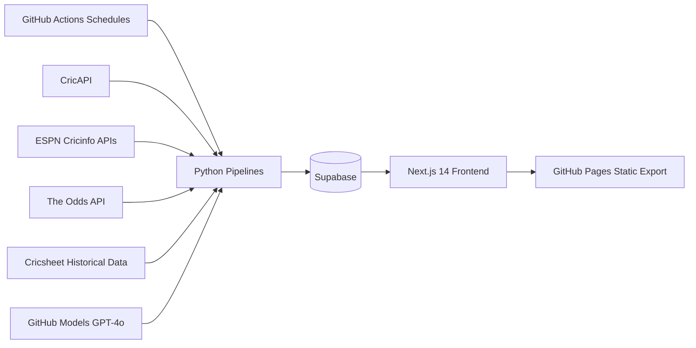

# 🏏 SixSense — AI Cricket Match Intelligence

SixSense is a full-stack cricket intelligence app that combines live fixtures, ESPN context, market odds, historical stats, and LLM reasoning into match-level prediction briefs.

It is no longer just a simple “winner predictor” — current builds include:
- a rich **match details cockpit** (edge score, squads/headshots, toss factor, H2H, series context, sportsbook view)
- **automated data pipelines** for fixtures/results/squads/headshots/odds/enrichment
- **evaluation surfaces** (history + calibration/accuracy dashboard)

---

## Current Architecture (audited from latest code)



### Data/Logic flow
1. **Fixtures ingestion** merges ESPN-first + CricAPI supplementary coverage.
2. **Stats caching** computes team/venue/H2H from Cricsheet and stores in `stats_cache`.
3. **Predictions** run via GPT-4o (GitHub Models), using:
   - cached form/H2H/venue stats,
   - enrichment notes,
   - ESPN context,
   - sportsbook signal,
   - proprietary **SixSense Edge Score™**.
4. **Results scorer** marks completed matches and computes correctness + Brier score.
5. **Calibration** periodically derives isotonic calibration bins.
6. Frontend reads Supabase directly and renders static-export pages.

---

## Latest App Features

### Match Details (majorly upgraded)
- **Hero verdict view** with team probabilities, formatted odds badges, and donut micro-legend.
- **SixSense Edge Score™** panel:
  - weighted factors: Form, Momentum, Pressure, Market,
  - dual-team color bars,
  - improved contrast/readability for labels + numbers.
- **Sportsbook Odds tile** with clickable bookmaker rows (new-tab outbound behavior).
- **Series context tile** moved higher in page flow for relevance.
- **Squad tile** with role-aware player cards and headshots.
- **Text-heavy cards** now support accordion-style **Show more / Show less** for readability.

### Dashboard & History
- Rolling accuracy trend.
- Calibration scatter chart (when enough data exists).
- Prediction history filters (`all/correct/incorrect`) with probability bar visualization.

### Headshot quality pipeline improvements
- Placeholder/logo image URLs are now treated as missing.
- Headshot resolver now supports CSV mapping + ESPN direct fallback.
- Existing squad rows can be backfilled via `fetch_headshots.py --force`.

---

## Latest Screenshots

> Screenshots below were captured from the current UI iteration and stored in `docs/screenshots/`.

### Match details — odds + interaction styling


### Edge score readability + contrast updates


### Match layout spacing refinements


### Squad/headshots (after resolver refresh)


### Prior placeholder-headshot state (before fix)


---

## Pipelines & Scheduled Workflows

| Workflow | Schedule | Purpose |
|---|---|---|
| `fetch-fixtures.yml` | every 2 hours | Pull upcoming fixtures (ESPN + CricAPI), backup score pass |
| `fetch-results.yml` | hourly | Score unscored predictions on completed matches |
| `fetch-squads.yml` | every 6 hours | Fetch squads, player stats, and headshots |
| `fetch-headshots.yml` | monthly | Full headshot refresh pass |
| `fetch-odds.yml` | every 2 hours | Pull bookmaker market data and map to matches |
| `enrich-matches.yml` | every 6 hours + after results run | LLM web/news enrichment with ESPN context |
| `run-predictions.yml` | daily (06:00 UTC) | Generate probabilities + reasoning + toss insight + edge score |
| `calibrate.yml` | weekly | Compute isotonic calibration bins |
| `deploy.yml` | on `main` push / manual | Build static frontend and deploy to GitHub Pages |

---

## Supabase Data Model (active surfaces)

Core tables used by the current app/pipelines:
- `matches` — canonical fixture records (`upcoming`/`completed`)
- `predictions` — winner, probabilities, confidence, reasoning, toss insight
- `prediction_results` — correctness + Brier score + scoring timestamp
- `stats_cache` — team/venue/H2H + calibration data
- `match_enrichment` — venue confidence, XI candidates, updates, source links, preview
- `espn_match_data` — verified venue/toss/rosters/H2H/standings/series context
- `match_squads` — team squad or XI snapshots with player metadata + image URLs
- `player_stats` — player batting/bowling aggregates by format
- `match_odds` — bookmaker odds snapshots
- `match_edge_scores` — stored multi-factor edge model output

SQL assets in repo:
- `supabase_schema.sql`
- `supabase/match_enrichment.sql`
- `supabase/stats_cache.sql`
- `supabase/migrations/003_espn_match_data.sql`

---

## Local Development

## 1) Python pipeline setup
```bash
python3 -m venv .venv
source .venv/bin/activate
pip install -r requirements.txt
cp .env.example .env
```

### Useful pipeline commands
```bash
# Historical datasets
python pipeline/fetch_cricsheet.py --types t20s odis

# Stats cache build
python pipeline/compute_stats.py --types t20s ipl

# Fixtures + mappings
python pipeline/fetch_fixtures.py

# Optional ESPN deep fetch for upcoming matches
python pipeline/fetch_espn.py --limit 20

# Enrichment pass
python pipeline/enrich_matches.py --limit 8 --source-limit 8

# Predictions
python pipeline/predict.py

# Results scoring
python pipeline/fetch_results.py

# Odds
python pipeline/fetch_odds.py

# Squads + player stats + headshots
python pipeline/fetch_squads.py
python pipeline/fetch_player_stats.py
python pipeline/fetch_headshots.py --force
```

## 2) Frontend setup
```bash
cd frontend
npm install
cp .env.example .env.local
npm run dev:mock
```

`npm run dev:mock` starts the local dev server with bundled mock fixtures, predictions, history, and dashboard data. Use `npm run dev` for live Supabase data. You can also flip demo/live data locally from the hidden menu toggle in the navbar.

---

## Environment Variables

### Pipeline (`.env`)
| Variable | Description |
|---|---|
| `GITHUB_TOKEN` | GitHub token (used for GitHub Models GPT-4o calls) |
| `SUPABASE_URL` | Supabase project URL |
| `SUPABASE_KEY` | Supabase service/anon key used by pipelines |
| `CRICAPI_KEY` | CricAPI key (fixtures/results/player stats fallback) |
| `ODDS_API_KEY` | The Odds API key |

### Frontend (`frontend/.env.local`)
| Variable | Description |
|---|---|
| `NEXT_PUBLIC_SUPABASE_URL` | Browser-accessible Supabase URL |
| `NEXT_PUBLIC_SUPABASE_ANON_KEY` | Browser-accessible Supabase anon key |
| `NEXT_PUBLIC_USE_MOCK_DATA` | Set to `true` to run the frontend against bundled demo cricket data |

---

## Deployment Notes

- Frontend uses `next export` mode (`output: "export"`) and deploys to **GitHub Pages**.
- If the repo visibility changes (public ↔ private), re-check **Settings → Pages** and ensure source is set to **GitHub Actions**.
- For private repos, Pages availability depends on your GitHub plan/org settings.

---

## Repository Layout

```text
frontend/                 Next.js app (Matches, Predict, Dashboard, History)
pipeline/                 ETL + prediction + enrichment + scoring jobs
pipeline/utils/           ESPN/CricAPI/Cricsheet/DB/Edge-score helpers
supabase/                 SQL for enrichment/cache/ESPN tables
.github/workflows/        Scheduled and deploy workflows
docs/screenshots/         Current UI screenshots used in this README
```

---

## Tech Stack

- **Frontend:** Next.js 14, React 18, Tailwind CSS, Framer Motion, Recharts, Supabase JS
- **Pipelines:** Python 3.11, OpenAI SDK, Requests, Pandas, scikit-learn, Supabase Python client
- **LLM:** GitHub Models (`openai/gpt-4o`)
- **Data sources:** ESPN Cricinfo APIs, CricAPI, The Odds API, Cricsheet
- **Hosting:** GitHub Pages via Actions

---

## License

MIT
